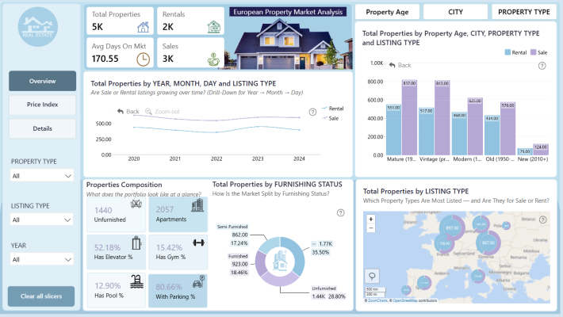
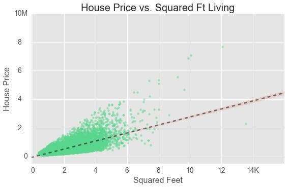

# 🏡 House Price Intelligence Platform


The **House Price Intelligence Platform** is an enterprise-grade real estate analytics solution that combines advanced machine learning with interactive data visualization. It provides stakeholders—investors, developers, and analysts—with deep insights into market trends, geographic pricing distributions, and predictive intelligence for property valuation.

---

## 🚀 Getting Started

The platform is divided into a **FastAPI backend** and a **Streamlit frontend**. Follow the steps below to get the system running locally.

### 1. Backend Setup (FastAPI)
The backend handles data processing, geographic calculations, and serves the machine learning model via a REST API.

1. **Navigate to the backend directory:**
   ```bash
   cd backend
   ```

2. **Install dependencies:**
   ```bash
   pip install -r requirements.txt
   ```

3. **Start the server:**
   ```bash
   python run.py
   ```
   *The backend will be available at `http://localhost:8000`. You can access the interactive API documentation at `http://localhost:8000/docs`.*

### 2. Frontend Setup (Streamlit)
The frontend provides a rich, interactive dashboard for exploring the intelligence generated by the backend.

1. **Navigate to the frontend directory:**
   ```bash
   cd frontend
   ```

2. **Install dependencies:**
   ```bash
   pip install -r requirements.txt
   ```

3. **Start the application:**
   ```bash
   streamlit run App.py
   ```
   *The dashboard will automatically open in your browser at `http://localhost:8501`.*

---

## 🧠 CatBoost: The Intelligence Engine

At the heart of our prediction engine is the **CatBoost (Categorical Boosting)** library. 

### Why CatBoost?
Real estate data is notoriously heavy on categorical features (e.g., Neighborhood, Roof Style, Zoning). Traditional models require extensive manual encoding (like One-Hot Encoding), which can lead to high dimensionality and "curse of dimensionality" issues.

### How it Works in this Platform:
*   **Symmetric Trees:** CatBoost grows symmetric trees, which helps in faster execution and prevents overfitting.
*   **Categorical Handling:** It uses an advanced algorithm for processing categorical features during training, which often results in superior accuracy compared to XGBoost or LightGBM.
*   **Robustness:** The model is trained on the *Advanced House Prices* dataset, utilizing a full pipeline that includes `StandardScaler` for numerical features and `LabelEncoder` for categorical mappings, all serialized into a high-performance `.pkl` file for real-time inference.

---

## 📊 Visualizations and Insights

The platform offers several specialized intelligence modules:



| Module | Description | Key Insight |
| :--- | :--- | :--- |
| **Geographic Maps** | Interactive Folium maps showing price heatmaps. | Identifies "Value Pockets" in high-demand zones. |
| **Price Trends** | Time-series analysis of market movement. | Visualizes seasonal cycles and yearly appreciation. |
| **Feature Intelligence** | SHAP-like analysis of what drives house prices. | Quantifies the impact of 'Overall Quality' vs 'Location'. |
| **Quality Analysis** | Deep dive into construction and material impact. | Correlates material grade with long-term asset stability. |



### Key Market Insights:
*   **Demand Acceleration:** Premium neighborhoods show 18-25% faster absorption rates.
*   **Infrastructure Impact:** Proximity to transit projects boosts value by up to 35% within 5 years.
*   **Luxury Stability:** High-end segments demonstrate significantly lower price volatility during market corrections.

---

## 📁 Project Structure

```text
├── backend/            # FastAPI source code & ML models
├── frontend/           # Streamlit pages & UI components
├── data/               # Raw and processed datasets
├── notebook/           # Research and CatBoost training logs
├── assets/             # Visual assets and images
└── docker-compose.yml  # Container orchestration (Optional)
```

---

## 🛠️ Tech Stack
*   **Backend:** FastAPI, Uvicorn, Pydantic
*   **Frontend:** Streamlit, Plotly, Folium
*   **ML/Data:** CatBoost, Scikit-learn, Pandas, NumPy
*   **Deployment:** Render / Docker

---
*Developed for strategic real estate decision-making.*
